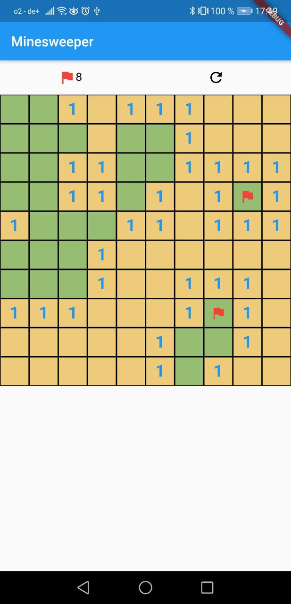
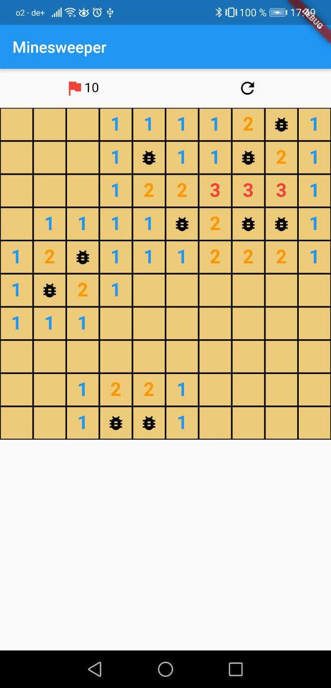

# minesweeper

Simple minesweeper Game implemented in Flutter.

## Run the app

```
flutter pub get
flutter run
```

## How to play

Basic rule is same as usual mineswepper game. But the default size of board and the number of mines are not customizable.
* Board is 10 X 10 with 10 mines total. 
* You can start game by clicking any slots in the board. 
* Put the flag with long press, once you think the slot might have mine. 
* If you flip mine, the app shows dialog that you lose. You are able to simply restart from there or close it and see the results.
* There is a 'restart' icon at the top, it resets the board and you can start again.

&nbsp;&nbsp;&nbsp;
